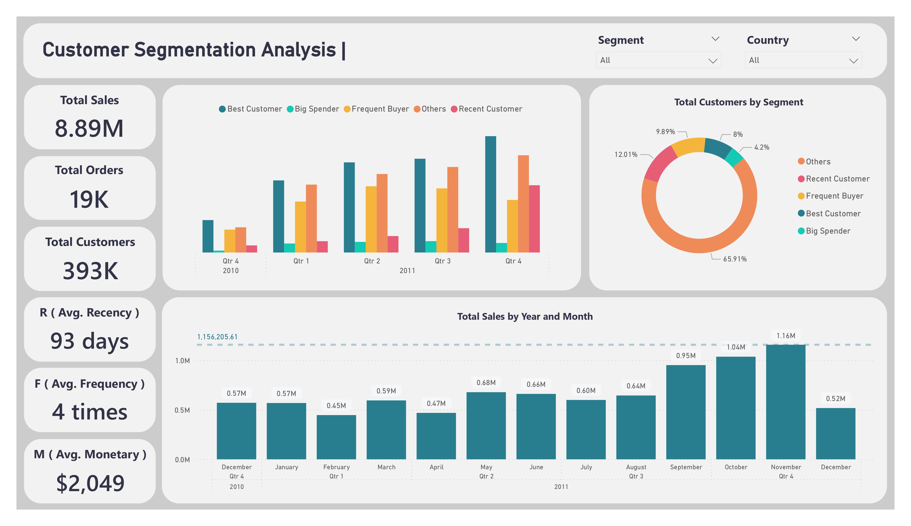

# 🛍️ Customer Segmentation with RFM Analysis

## 📌 Overview

This project performs customer segmentation on the **UCI Online Retail dataset** using **RFM (Recency, Frequency, Monetary) analysis** to uncover valuable customer insights. The goal is to help businesses identify and understand their most profitable customer groups to drive targeted marketing and strategic decision-making.

---

## 📂 Dataset

- **Source**: [UCI Machine Learning Repository – Online Retail](https://archive.ics.uci.edu/ml/datasets/Online+Retail)
- **Description**: Transactional data for a UK-based online gift retailer between **Dec 2010 and Dec 2011**.
- **Fields include**: InvoiceNo, StockCode, Description, Quantity, InvoiceDate, UnitPrice, CustomerID, Country.

---

## ⚙️ Tools & Technologies

- **Python**: Data wrangling and RFM scoring (Pandas, NumPy)
- **Visualization**: Matplotlib, Seaborn
- **Power BI**: Dashboard creation and interactive analytics
- **Jupyter Notebook**: Exploratory data analysis and modeling

---

## 📊 Key Steps

### 1. Data Cleaning
- Removed missing `CustomerID` values
- Filtered returns and negative quantities
- Converted `InvoiceDate` to datetime format

### 2. Feature Engineering
- Calculated **Recency**, **Frequency**, and **Monetary** values per customer
- Scored each RFM component (1 to 5 scale)
- Created **customer segments** based on RFM scores

### 3. Segment Definitions (Sample)
| Segment           | Count |
|-------------------|-------|
| Others            | 2859  |
| Recent Customers  | 521   |
| Frequent Buyers   | 429   |
| Best Customers    | 347   |
| Big Spenders      | 182   |

### 4. Visualizations
- **RFM Score Heatmap**
- **Segment Distribution Pie Chart**
- **Sales Over Time (by Month)**
- **Top Countries by Sales**
- **Radar Chart of Segments**

---

## 📈 Power BI Dashboard (One-Page Summary)

The final Power BI dashboard includes:
- **Key Metrics**: Total Sales (~$8.9M), Orders (19K), Unique Customers (~4K)
- **Customer Segmentation**: Pie chart breakdown of segments
- **Sales Trend Line**: Sales peaked in November, indicating seasonal demand
- **Sales by Segment & Country**: Clustered bar chart for region-specific performance
- **Slicers**: Interactive filters for country and segment

---

## 📸 Dashboard Preview

---

## 🔍 Key Insights

- 📌 **Sales Growth**: Low sales through September, spiking in **November**, then dropping in **December**
- 📌 **UK** dominates total sales, followed by **Netherlands** and **Germany**
- 📌 **Best Customers** and **Frequent Buyers** generate most revenue
- 📌 High percentage of customers fall into the **Others** segment, suggesting re-engagement potential

---

## ✅ Recommendations

- 🎯 Launch targeted marketing campaigns for high-value segments
- 🛍️ Consider loyalty programs for Frequent Buyers and Big Spenders
- 📧 Develop email campaigns or discounts for Recent and low-engagement customers
- 🌍 Expand reach in high-performing international markets like Netherlands and Germany

---

## 📎 License & Attribution

- Dataset © UCI Machine Learning Repository  
- This project is for educational and non-commercial use.

---

## 📬 Contact

Feel free to connect or reach out for collaboration or questions:  
[Reham Mahmoud] – [[LinkedIn Profile](https://www.linkedin.com/in/reham-mahmoud-rushdi/)]
